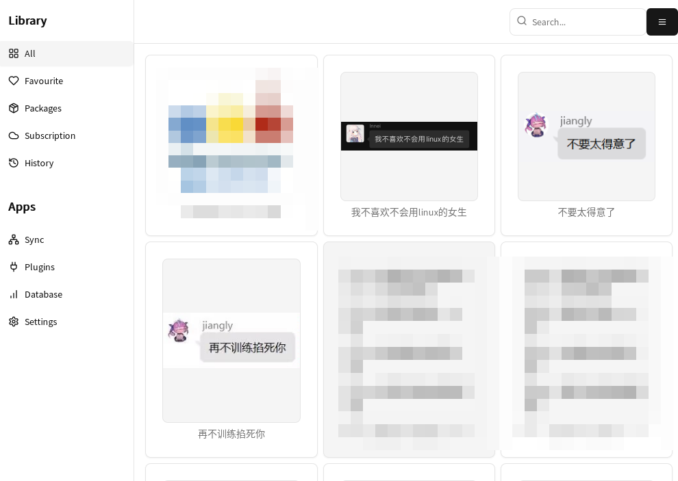

# Sticker Bucket


<div align="center">
<table>
<tr>
<td align="center">

</td>
</tr>
<tr>
<td>


</td>

</tr>
</table>
</div>

[WIP] 该项目仍在缓慢开发中

使用 Tauri 2.0 开发的简易表情包管理器，支持 Linux/MacOS/Windows 系统

目前开发进度及计划可见 [GitHub Project](https://github.com/users/mslxl/projects/3)

## 截图


## 帮助

### 标签

StickerBucket 采用类似 EHentai 的标签。标签具有 namespace 和 value 两部分。作者推荐采用类似 EHentai 的标签分类机制进行管理。例如 `character:amiya parody:arknights` 即为《明日方舟》中的阿米娅。

后续可能会采用智能算法自动推算 `character`、`parody` 等 namespace 的标签

### 搜索

StickerBucket 可以搜索名称中的关键字、标签和元信息。例如 `nanoda character:yukikaze parody:"azur lane" -misc:nsfw $package:Inbox $sort:name $order:desc` 即为：
- 名称中含有 `nanoda` 关键字
- 具有 `character:yukikaze` 标签
- 具有 `parody:azur lane` 标签
- 不具有 `misc:nsfw` 标签
- 在 `Inbox` 表情包中
- 以 `name` 字段排序
- 降序排序


多个搜索条件中用任意个空格连接。

#### 搜索关键字

直接输入关键字即可。例如 `nanoda` 将会搜索所有名称中含有 `nanoda`的表情

#### 搜索标签

输入 `<namespace>:<value>` 进行搜索，如果 namespace 或者 value 中有分号或者空格，可使用引号将其括起来。例如 `character:yukikaze parody:"azur lane"`

#### 元信息

使用 `$<meta-key>:<value>` 进行搜索，例如 `$package:Inbox`。

目前可用的元信息有:
- `package`
    + `<包名>`：搜索在指定表情包下的内容
- `date-start`
    + `<日期>`：搜索在指定日期后修改过的内容
- `date-end`：
    + `<日期>`：搜索在指定日期前搜索过的内容
- `sort`:
    + `name`：使用名称作为关键字排序
    + `create`：使用创建时间作为关键字排序
    + `modify`：使用修改时间作为关键字排序
- `order`:
    + `asc`：升序排序（默认）
    + `desc`：降序排序


#### 排除搜索

在关键字和标签的搜索条目前加入半角减号可排序该条。例如 `-misc:nsfw` 可排序所有带有 `misc:nsfw` 的标签

注意元信息搜索条目不能被排除

## 安装

### Flake

#### 将此仓库添加到 Flake Input

```nix
inputs = {
    sticker-bucket = {
        url = "github:mslxl/sticker-bucket";
    };
    # ...
};
```

#### 添加 packages

```nix
let
    system = "x87_64-linux";
in {
    environment.systemPackages = with pkgs; [
        # ...
        inputs.sticker-bucket.packages.${system}.default  
    ];
}
```

### 通过源码安装

#### 安装系统依赖

请参考 [Tauri 2.0 System Dependencies](https://v2.tauri.app/start/prerequisites/) 安装系统依赖。除此之外，您还需要:

- `pnpm`
- `cmake`
- `xmake`

#### 安装代码依赖

```bash
$ pnpm install
```

#### 编译

```bash
pnpm tauri build
```

安装文件可在 `src-tauri/bundle` 中找到


## 鸣谢

- [MeetWq/meme-generator](https://github.com/MeetWq/meme-generator)：表情编辑的 IDEA
- [CompVis/stable-diffusion](https://github.com/CompVis/stable-diffusion)：绘制应用图标
- [RimoChan/waifu-sensor](https://github.com/RimoChan/waifu-sensor)：可解释的动漫角色分类模型
- [pot-app/pot-desktop](https://github.com/pot-app/pot-desktop)：OCR 参考
- ~~感谢我家里的猫，虽然我家并没有养猫~~
