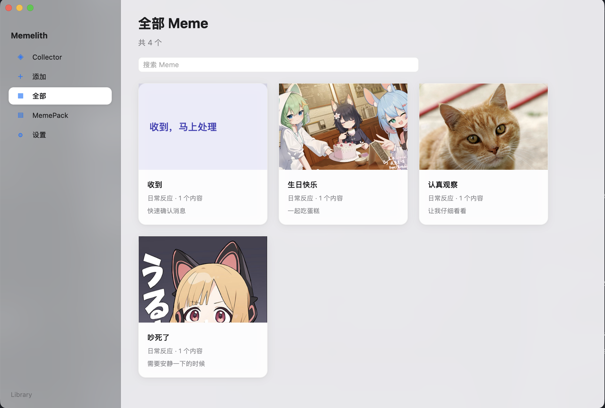

# Memelith

Memelith is a local-first desktop library for collecting, organizing, and
finding memes. It keeps media in a storage directory chosen by the user and
stores the searchable index in SQLite, so the library remains usable without a
hosted service.



## What it does

- Collect images or text into an inbox before deciding how to organize them.
- Detect exact duplicates with content hashes and flag visually similar images
  with local CLIP embeddings. Similarity suggestions can be dismissed when an
  item is intentionally different.
- Save memes with a name, description, tags, and one or more image, animated
  media, or text contents.
- Organize the library into editable MemePacks and browse all saved memes from
  one searchable view.
- Search meme names, descriptions, tags, content types, and text contents with
  field-aware expressions.
- Analyze images with Waifu Sensor to suggest anime-character tags while
  adding a meme.
- Receive images and text through a Telegram Bot and synchronize Telegram
  sticker packs into MemePacks. Telegram integration is optional and disabled
  until configured in Settings.
- Keep the meme library's media and SQLite index under a user-selected local
  storage root.

## Getting started

### Use a release build

Release workflows produce a macOS DMG, Linux packages, and Windows installers
or a portable executable. Download the artifact for your platform from the
project's release page, then launch Memelith and choose a storage directory in
Settings.

### First launch

The macOS application bundle does not include the ONNX model binaries. On the
first launch, Memelith downloads about 992 MiB of pinned model files, verifies
their byte sizes and SHA-256 digests, and stores them under
`~/Library/Application Support/memelith/models`. A network connection is
required only for this initial setup (or when a cached model is missing or
invalid). Completed installations use a lightweight metadata receipt on later
launches instead of hashing every model again, and interrupted downloads resume
from the saved partial file. The exact sources and checksums are documented in
[`docs/onnx-model-sources.md`](docs/onnx-model-sources.md).

### Typical workflow

1. Open **Collector** and paste text or select one or more images.
2. Review duplicate warnings, dismiss false similarity matches, and select the
   items to keep.
3. Promote the selection to a MemePack, add a name or description, and attach
   tags. The **Add** page can also create a meme directly from new content.
4. Use **All** to search and browse the library, or open **MemePack** to manage
   collections. Configure the optional Telegram Bot and storage root in
   **Settings**.

## Development

This is a Rust workspace. When `flake.nix` is available, enter the development
shell before running the commands below:

```sh
nix develop
```

Run the GUI locally:

```sh
cargo run -p memelith
```

Run all workspace checks and tests:

```sh
cargo test --workspace
```

Build the native macOS application bundle from the workspace root:

```sh
nix develop --command scripts/package-macos.sh
```

The application is written to
`target/macos-bundle/release/bundle/osx/Memelith.app`. The script bundles
non-system dynamic libraries and applies an ad-hoc signature by default. Set
`CODESIGN_IDENTITY` to use an installed signing identity instead. The generated
arm64 bundle requires macOS 14 or later.

The workspace enables GPUI's `runtime_shaders` feature so macOS development does
not require the Metal command-line compiler. Release packaging can disable this
feature when a full Xcode installation is available.

## Workspace layout

- `apps/gui` - GPUI desktop application, model setup, search, and Telegram
  integration.
- `crates/core` - SQLite-backed meme, MemePack, tag, Collector, and duplicate
  detection logic.
- `crates/clip` - local FP32 ONNX text and image encoders in a shared
  512-dimensional embedding space.
- `crates/waifu-sensor` - explainable anime-character retrieval and its optional
  CLI.
- `crates/character-segmentation` - AnimeInsSeg and YOLO11 ONNX segmentation
  tools with cross-model duplicate suppression.
- `crates/liquid-glass` - reusable GPUI visual components.

Build the independent Waifu Sensor CLI:

```sh
cargo build -p waifu-sensor --features cli --bin waifu-sensor
```

Run local YOLO11n segmentation after exporting a model to ONNX:

```sh
cargo run -p character-segmentation --bin yolo11-seg -- \
  --model /path/to/yolo11n-seg.onnx \
  --image input.png \
  --output-dir output \
  --class-label person
```

Run both local character-segmentation backends on the same image:

```sh
cargo run -p character-segmentation --release -- \
  --anime-model /path/to/rtmdetl_e60.raw.640.onnx \
  --yolo-model /path/to/yolo11n-seg.onnx \
  --image input.png \
  --output-dir output \
  --merge-iou 0.6
```

This writes the untouched `animeinsseg/` and `yolo11n-seg/` results plus a
`merged/` directory where overlapping predictions retain the
higher-confidence instance.

## License

Workspace code is licensed under **AGPL-3.0-or-later**. The bundled and
downloaded model assets have separate upstream licensing and redistribution
terms; see [`docs/onnx-model-sources.md`](docs/onnx-model-sources.md) and the
model metadata before redistributing them.
